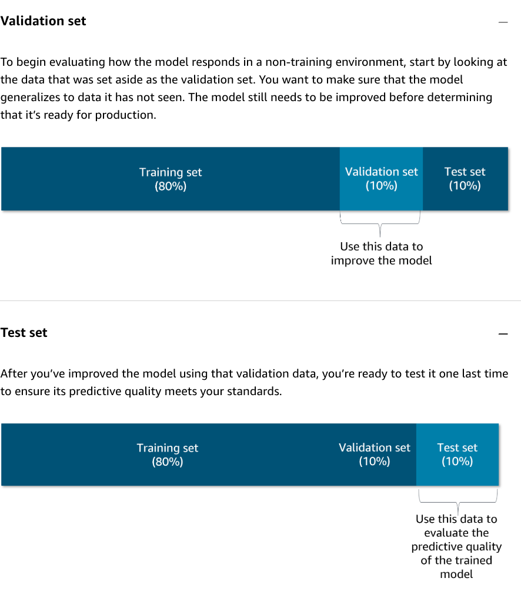

# Model Evaluation and Metrics

> **AWS AI Practitioner Exam (AIF-C01) Study Guide**

Evaluating an AI model correctly is critical for ensuring it is reliable, safe, and cost-effective. The metrics we use depend on whether we are looking at traditional ML (Classification/Regression) or Generative AI (Language/Images).

---

## 🏗️ Model Evaluation Datasets

Evaluation occurs after a model is trained. To ensure a model generalizes well to new data (rather than just memorizing the training data), the available data is typically partitioned into three parts.

1.  **Training Set (80%)**
    The data used to actually train the model. The model learns patterns and relationships from this set.
2.  **Validation Set (10%)**
    The data set aside to evaluate how the model responds in a non-training environment. You use this data to **improve the model** (tuning hyperparameters) and ensure it generalizes to unseen data.
3.  **Test Set (10%)**
    After you have improved the model using the validation data, you use the test set for a final evaluation. This measures the final predictive quality and ensures the model meets your performance standards before production deployment.

---

## ⚖️ Model Fit

Model fit is essential for understanding the root cause of poor model accuracy. By analyzing where the model fails, you can take specific corrective steps. 

### Detecting Fit via Prediction Error
You can determine the state of your model by comparing the **prediction error** on the **training data** versus the **evaluation data**.

#### 1. Underfitting
*   **Behavior:** Performs poorly on the **training data**.
*   **Cause:** The model is too simple (the input features are not expressive enough) to capture the relationship between inputs (X) and target values (Y).
*   **Visual:** The model remains far from the data points even in training.

#### 2. Overfitting
*   **Behavior:** Performs well on **training data** but poorly on **evaluation data**.
*   **Cause:** The model has "memorized" the specific training examples and noise rather than learning the general underlying patterns. It is unable to **generalize** to unseen examples.
*   **Visual:** The model zig-zags to hit every training point perfectly, missing the overall trend.

#### 3. Balanced
*   **Behavior:** Consistent performance across both training and evaluation data.
*   **Goal:** The model is not overfit or underfit; it has captured the core trend without sacrificing generalization.

---

## 1. Generative AI Metrics (LLMs)

### Perplexity (PPL)
Perplexity measures how well a probability model predicts a sample. 
*   **Conceptual Meaning:** "How confused is the model?"
*   **Scoring:** **Lower is better.** A lower perplexity means the model is more confident in its predictions.
*   **Key Fact:** It is an *intrinsic* metric, meaning it measures the model's internal logic without needing a human "correct answer" to compare against.

### ROUGE (Recall-Oriented Understudy for Gisting Evaluation)
Used primarily for **Text Summarization**.
*   **How it works:** It counts how many words in the model's summary also appear in a "reference" summary written by a human.
*   **Metric Focus:** It focuses on **Recall** (did we capture all the important points?).

### BLEU (Bilingual Evaluation Understudy)
Used primarily for **Machine Translation**.
*   **How it works:** It measures the overlap between a model's translation and a human's translation.
*   **Metric Focus:** It focuses on **Precision** (how accurate are the words we chose?).

---

## 2. Traditional ML Metrics (Recap)

### Classification (Discrete Categories)
*   **Accuracy:** Overall correctness. Useful only for balanced datasets.
*   **Precision:** "Of all the positives we predicted, how many were right?" (Avoids False Positives).
*   **Recall:** "Of all the actual positives that exist, how many did we find?" (Avoids False Negatives).
*   **F1-Score:** The harmonic mean of Precision and Recall. Best for imbalanced data.
*   **Confusion Matrix:** A table Layout showing True Positives (TP), False Positives (FP), True Negatives (TN), and False Negatives (FN).

### Regression (Predicting Numbers)
*   **RMSE (Root Mean Square Error):** Measures the average "distance" between the predicted number and the actual number. Penalizes large errors heavily.
*   **MAE (Mean Absolute Error):** Similar to RMSE but doesn't penalize large outliers as aggressively.

---

## 3. The "Confusion" vs. "Confidence" Comparison

| Goal | Metric | Logic |
| :--- | :--- | :--- |
| **Measure Uncertainty** | **Perplexity** | How many options did the model struggle to choose between? |
| **Measure Text Quality**| **ROUGE / BLEU** | How close is the output to a "perfect" human example? |
| **Measure Factual Accuracy** | **Logprobs** | What was the mathematical probability (0-1) of the chosen word? |

---

## 4. Exam Tips: Which Metric to Choose?

*   **Summarization/Captions?** Choose **ROUGE**.
*   **Translation?** Choose **BLEU**.
*   **Model "Guts"/Confidence?** Choose **Perplexity** or **Logprobs**.
*   **Cancer detection or Medical?** Choose **Recall** (You cannot afford to miss a positive).
*   **Email Spam filtering?** Choose **Precision** (You cannot afford to accidentally block a real email).

---
*Last Updated: Jan 2026*
