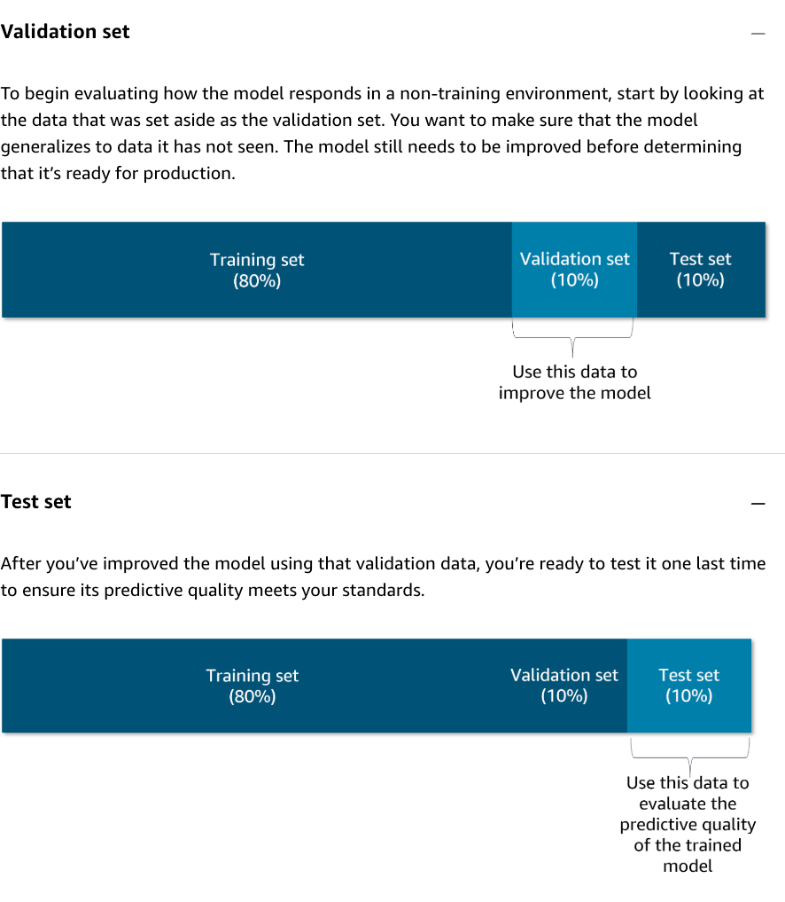

# Model Evaluation and Metrics

> **AWS AI Practitioner Exam (AIF-C01) Study Guide**

Evaluating an AI model correctly is critical for ensuring it is reliable, safe, and cost-effective. The metrics we use depend on whether we are looking at traditional ML (Classification/Regression) or Generative AI (Language/Images).

---

## 🏗️ Model Evaluation Datasets

Evaluation occurs after a model is trained. To ensure a model generalizes well to new data (rather than just memorizing the training data), the available data is typically partitioned into three parts.

1.  **Training Set (80%)**
    The data used to actually train the model. The model learns patterns and relationships from this set.
2.  **Validation Set (10%)**
    The data set aside to evaluate how the model responds in a non-training environment. You use this data to **improve the model** (tuning hyperparameters) and ensure it generalizes to unseen data.
3.  **Test Set (10%)**
    After you have improved the model using the validation data, you use the test set for a final evaluation. This measures the final predictive quality and ensures the model meets your performance standards before production deployment.

---

## ⚖️ Model Fit

Model fit is essential for understanding the root cause of poor model accuracy. By analyzing where the model fails, you can take specific corrective steps. 

### Detecting Fit via Prediction Error
You can determine the state of your model by comparing the **prediction error** on the **training data** versus the **evaluation data**.

#### 1. Underfitting (High Bias)
*   **Behavior:** Performs poorly on the **training data**.
*   **Cause:** The model is too simple (the input features are not expressive enough).

#### 2. Overfitting (High Variance)
*   **Behavior:** Performs well on **training data** but poorly on **evaluation data**.
*   **Cause:** The model has "memorized" the training noise rather than learning general patterns.

#### 3. Balanced (Ideal)
*   **Goal:** Low bias and low variance. Consistency across both training and evaluation data.

---

## 📊 Classification Problem Metrics

Classification involves Assigning labels or categories to data. Evaluation is done by comparing model predictions against known target values in a "held-out" dataset.

### 🧩 The Confusion Matrix: The "Truth Table"
A Confusion Matrix is a table used to describe the performance of a classification model. It is called "Confusion" because it shows exactly how much the model is **confusing** two classes (e.g., calling a cat a dog).

#### 🏥 Practical Example: The Medical Test
Imagine a model designed to detect a rare disease. We test it on 100 people.
*   **Actual Positive:** Person actually has the disease.
*   **Actual Negative:** Person is healthy.

| | **Actual: Sick (+)** | **Actual: Healthy (-)** |
| :--- | :--- | :--- |
| **Predicted: Sick (+)** | **True Positive (TP)**   (Correctly caught the sick person) | **False Positive (FP)**   (Healthy person told they are sick - **Type I Error**) |
| **Predicted: Healthy (-)**| **False Negative (FN)**   (Sick person told they are healthy - **Type II Error**) | **True Negative (TN)**   (Correctly identified a healthy person) |

---

### 🧠 Breaking Down the 4 Quadrants (ELI5)

1.  **True Positive (TP):** "The model said you're pregnant, and you are!" (**Success**)
2.  **True Negative (TN):** "The model said you're NOT pregnant, and you're not!" (**Success**)
3.  **False Positive (FP):** "The model told a MAN he is pregnant." (**False Alarm**)
    *   *Also called:* **Type I Error**.
4.  **False Negative (FN):** "The model told a PREGNANT WOMAN she is not pregnant." (**Dangerous Miss**)
    *   *Also called:* **Type II Error**.

!!! warning "Exam Critical: Cost of Errors"
    The exam will ask which error is worse for a specific scenario:
    *   **In Healthcare (Cancer):** A **False Negative (FN)** is the worst because a patient goes untreated.
    *   **In Security (Spam):** A **False Positive (FP)** is the worst because you lose a real email from your boss.

### Key Metrics
*   **Accuracy** 
    *   **Formula:** `(TP + TN) / (TP + TN + FP + FN)`
    *   **Logic:** Overall correctness.
    *   **Limitation:** Less effective when there are many True Negative cases (imbalanced data).
*   **Precision**
    *   **Formula:** `TP / (TP + FP)`
    *   **Focus:** Proportion of positive predictions that are actually correct.
    *   **When to use:** When the cost of **False Positives** is high.
    *   *Example:* **Email Spam Filtering**. You don't want legitimate emails sent to spam.
*   **Recall (Sensitivity)**
    *   **Formula:** `TP / (TP + FN)`
    *   **Focus:** Proportion of actual positives correctly identified.
    *   **When to use:** When the cost of **False Negatives** is high.
    *   *Example:* **Terminal Illness Diagnosis**. It is vital not to miss a sick patient.
*   **F1-Score**
    *   **Logic:** The harmonic mean of Precision and Recall. Best "all-around" metric for imbalanced datasets.
*   **AUC-ROC (Area Under Curve)**
    *   **ROC:** A probability curve plotting True Positive Rate vs. False Positive Rate at various thresholds.
    *   **AUC:** Represents the degree of **separability**. It shows how well the model can distinguish between classes.

---

## 🔢 Regression Problem Metrics

Regression predicts continuous numerical values. Evaluation focuses on the difference between the prediction and the actual outcome.

*   **Mean Squared Error (MSE)**
    *   **Calculation:** Sum up the squares of the differences between predicted and actual values.
    *   **Goal:** The **smaller the MSE**, the better the predictive accuracy.
*   **R-Squared (R²)**
    *   **Logic:** Explains the fraction of variance accounted for by the model (scored 0 to 1).
    *   **Goal:** A value close to 1 indicates the model explains most of the data's variance.

---

## 🧠 Generative AI Metrics (FMs)

Evaluating Foundation Models (FMs) is unique because their outputs are creative and open-ended. Evaluation is split into **Automatic** (algorithmic) and **Human** (subjective) methods.

### 🤖 Automatic Evaluation Metrics
These metrics compare the model's output to a "Gold Standard" (human-written reference) using math. 

!!! info "Deep Dive"
    For a simpler, more detailed breakdown of these metrics with analogies, see our [GenAI Metrics Deep Dive (ELI5)](07a-gen-ai-metrics-deep-dive.md).

| Metric | Full Name | Primary Use Case | Logic |
| :--- | :--- | :--- | :--- |
| **Perplexity (PPL)** | - | **General Language** | Measures how well the model predicts symbols. **Lower is better** (less "confused"). |
| **ROUGE** | Recall-Oriented Understudy for Gisting Evaluation | **Summarization** | Focuses on **Recall**. Did the model capture all the key points from the reference? |
| **BLEU** | Bilingual Evaluation Understudy | **Translation** | Focuses on **Precision**. How much of the model's output matches the human translation? |
| **METEOR** | Metric for Evaluation of Translation with Explicit ORdering | **Translation** | Similar to BLEU but considers synonyms and grammar. |
| **BERTScore** | - | **Semantic Similarity** | Uses embeddings to see if the *meaning* matches, even if the words are different. |

### 🛡️ Safety & Alignment Metrics
Required for **Responsible AI** to ensure the model isn't dangerous.
*   **Toxicity:** Measures the presence of hate speech, insults, or profanity.
*   **Stereotyping:** Detects if the model produces biased or discriminatory content.
*   **Semantic Robustness:** Measures how much the output changes when the input is slightly modified (e.g., adding a typo). A robust model should give the same answer.

### 👥 Human Evaluation (Bedrock Model Evaluation)
Some things can't be measured by math. Amazon Bedrock allows two types of Human Evaluation:
1.  **Your Own Employees:** Internal team members review and score the model.
2.  **AWS Managed Team:** You hire a specialized AWS team to perform the evaluation.

**Typical Human Scoring Criteria (The "HHH" Framework):**
*   **Helpfulness:** Does it actually answer the user's prompt?
*   **Honesty:** Is the information factually accurate (no hallucinations)?
*   **Harmlessness:** Does it avoid toxic or dangerous content?
*   **Brand Voice:** Does the tone match the company's personality?

---

## 💼 Business Metrics and KPIs

Model performance must align with business goals established in the **Business Goal Identification** phase.

*   **KPI Alignment:** Link numerical metrics (Precision/Recall) to business results like increasing sales or cutting costs.
*   **Cost Functions:** Specify the economic impact of correct predictions vs. errors.
*   **A/B Testing & Canary Deployments:** Experiment with multiple variants of a model to determine which best achieves business goals in production.

---
*Last Updated: Jan 2026*
