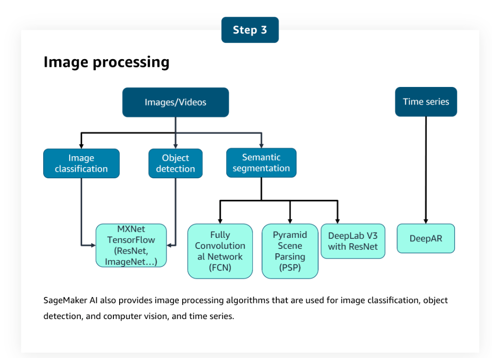

# Amazon SageMaker AI Features

> **AWS AI Practitioner Exam (AIF-C01) Study Guide**

Amazon SageMaker AI is a fully managed ML service. In a single unified visual interface, you can perform the following tasks:
1.  **Collect and prepare data.**
2.  **Build and train machine learning models.**
3.  **Deploy the models and monitor the performance of their predictions.**

---

## 🏗️ SageMaker AI Feature Categories

SageMaker AI provides specialized tools for every stage of the machine learning lifecycle.

### 1. Data Preparation
*   **Amazon SageMaker Data Wrangler**
    A low-code/no-code (LCNC) tool to import, prepare, transform, featurize, and analyze data through a web interface. You can also add custom Python scripts for advanced workflows.
*   **SageMaker Studio Classic Integration**
    Built-in integration with **Amazon EMR** and **AWS Glue** for large-scale interactive data preparation and ML workflows within notebooks.
*   **SageMaker Processing API**
    Allows running scripts and notebooks to process, transform, and analyze datasets. Supports frameworks like scikit-learn, MXNet, and PyTorch.

### 2. Feature Management
*   **Amazon SageMaker Feature Store**
    A purpose-built repository to create, share, and manage features for ML development. It allows data to be ingested, stored, retrieved, and served to ML models for inference.

### 3. Model Building & Training
*   **Training Jobs**
    SageMaker launches ML compute instances, uses your code/dataset to train the model, and saves artifacts in **Amazon S3**.
*   **Amazon SageMaker Canvas**
    The primary LCNC option. It allows business analysts to build ML models and generate predictions **without writing any code**.
*   **Amazon SageMaker JumpStart**
    A hub for pre-trained, open-source models (Foundation Models, etc.) that you can deploy or fine-tune with one click.

### 4. Model Evaluation & Tuning
*   **Amazon SageMaker Experiments**
    A tool to track and compare multiple combinations of data, algorithms, and parameters to observe their impact on model accuracy.
*   **Automatic Model Tuning (Hyperparameter Tuning)**
    Finds the best version of your model by running multiple training jobs with different combinations of hyperparameters and measuring success against a chosen metric.

### 5. Deployment & Inference
*   SageMaker provides a broad selection of ML infrastructure (CPU/GPU/Inferentia) and deployment options (Real-time, Batch, Serverless, Asynchronous) to meet various latency and cost requirements.

### 6. Monitoring & Optimization
*   **Amazon SageMaker Model Monitor**
    Observes the quality of production models. It detects violations of user-defined thresholds for:
    - **Data Quality:** Changes in data distribution.
    - **Model Quality:** Accuracy drift.
    - **Bias Drift:** Emergence of bias over time.
    - **Feature Attribution Drift:** Changes in which features contribute most to predictions.

---

## �️ SageMaker AI Workflow

SageMaker AI allows you to automate and manage the end-to-end ML lifecycle.

1.  **Prepare Data**: Use **SageMaker Data Wrangler** and **Processing Jobs** to clean and transform raw data.
2.  **Curate Features**: Store processed data in the **SageMaker Feature Store** for consistent use across training and inference.
3.  **Train Model**: Run **SageMaker Training Jobs** using built-in algorithms or custom scripts.
4.  **Experiment Tracking**: Use **SageMaker Experiments** to monitor and compare multiple training runs.
5.  **Evaluate Model**: Run **Processing Jobs** to calculate evaluation metrics (Accuracy, RMSE, etc.).
6.  **Register Model**: Store the best model version in the **SageMaker Model Registry**.
7.  **Deploy Model**: Deploy the model to an endpoint for real-time or batch **Deployments**.
8.  **Manage Model**: Use **SageMaker Model Monitor** to detect drift and maintain quality in production.
9.  **Automation**: Orchestrate the entire flow using **SageMaker AI Pipelines**.

---

## �📂 Sources of ML Models

SageMaker AI provides multiple ways to build models, ranging from "zero-effort" to "full customization."

| Method | Level of Effort | Description |
| :--- | :--- | :--- |
| **Pre-trained Models** | **Least Effort** | Models ready to deploy or fine-tune immediately using **SageMaker JumpStart**. |
| **Built-in Algorithms** | **Medium Effort** | Highly optimized algorithms provided by AWS that scale automatically for large datasets. |
| **Pre-made Framework Images** | **High Effort** | Use pre-configured Docker images for common frameworks like **TensorFlow, PyTorch, scikit-learn, MXNet, or Chainer**. |
| **Custom Docker Images** | **Most Effort** | Build and bring your own Docker image with specific packages and software required for your unique model. |

---

## 🧮 SageMaker AI Built-in Algorithms (Cheat Sheet)

SageMaker AI provides algorithms for different categories of machine learning problems.

### 1. Supervised Learning
SageMaker AI provides several built-in general-purpose algorithms that you can use for either classification or regression problems.

*   **Linear Learner**
    **Exam Triggers:** "Base-line," "Simple Regression/Classification," "Yes/No."
    **Typical Use Case:** Predicting simple house prices.

*   **XGBoost**
    **Exam Triggers:** **"Tabular Data,"** "Highly Accurate," "Structured Data."
    **Typical Use Case:** Predicting customer churn or defaults.

*   **Factorization Machines**
    **Exam Triggers:** **"Sparse Data,"** "Recommendation Systems."
    **Typical Use Case:** Predicting movie ratings for recommendation engines.

*   **K-Nearest Neighbors (KNN)**
    **Exam Triggers:** "Proximity," "Similarity," "Non-parametric."
    **Typical Use Case:** Classifying images based on similarities.

---

### 2. Unsupervised Learning
Used for discovering hidden patterns without the need for pre-existing labels.

*   **K-means**
    **Exam Triggers:** **"Clustering,"** "Groupings," "Segmentation."
    **Typical Use Case:** Dividing customer bases for targeted ads.

*   **LDA & NTM**
    **Exam Triggers:** **"Topic Modeling,"** "Document Themes."
    **Typical Use Case:** Finding themes in thousands of news articles.

*   **Object2Vec**
    **Exam Triggers:** **"Embeddings,"** "Vectorization," "Similarity Scaling."
    **Typical Use Case:** Creating math-based representations of books.

*   **PCA**
    **Exam Triggers:** **"Feature Reduction,"** "Visualization," "Removing Noise."
    **Typical Use Case:** Simplifying 100 columns into 3 "main" columns.

*   **Random Cut Forest (RCF)**
    **Exam Triggers:** **"Anomaly Detection,"** "Streaming Data," "Outliers."
    **Typical Use Case:** Spotting suspicious spikes in login attempts.

*   **IP Insights**
    **Exam Triggers:** "IP Addresses," "Security Patterns," "Anomalies."
    **Typical Use Case:** Flagging logins from unusual geographic locations.

---

### 3. Image Processing & Computer Vision
Specialized algorithms for visual data and time-series forecasting.

*   **Image Classification**
    **Exam Triggers:** **"What is it?"** "Single Label," "ResNet/ImageNet."
    **Typical Use Case:** Identifying a "Tractor" vs. a "Truck."

*   **Object Detection**
    **Exam Triggers:** **"Where is it?"** "Multiple Labels," "Bounding Boxes."
    **Typical Use Case:** Drawing boxes around "Cars" and "Pedestrians."

*   **Semantic Segmentation**
    **Exam Triggers:** **"Pixel-level,"** "Masking," "Precise Boundaries."
    **Typical Use Case:** Identifying exact pixels of a tumor in an X-ray.

*   **DeepAR**
    **Exam Triggers:** **"Forecasting,"** "Seasonality," "Time Series."
    **Typical Use Case:** Predicting future sales or stock levels.

---

### 4. Text Analysis & NLP
Algorithms designed for understanding and generating human-like text.

*   **BlazingText**
    **Exam Triggers:** **"Word2Vec,"** "High-speed Text Classif," "Sentiment Analysis."
    **Typical Use Case:** Analyzing sentiment in millions of app reviews.

*   **Seq2Seq**
    **Exam Triggers:** **"Translation,"** "Summarization," "Speech-to-Text."
    **Typical Use Case:** Automatically translating legal documents.

---
*Last Updated: Jan 2026*
